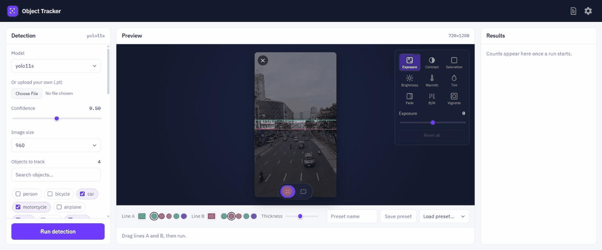
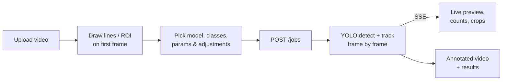

<div align="center">


# Object Tracker

**Count and track vehicles in video — draw a line, hit run, watch it count.**

YOLO11 detection + tracking, a live-streaming FastAPI backend, and a React UI that runs as a local desktop app.


<br />



<sub>Upload a clip → place the counting lines → run. Boxes, track IDs, counts and per-vehicle crops stream in live.</sub>

</div>

---

## Features

| | |
|---|---|
| **Line-crossing counts** | Two draggable lines (A / B) count vehicles in each direction: *crossed A then B* and *crossed B then A*. |
| **ROI mode** | Restrict detection to a region of interest instead of counting lines. |
| **Live progress** | Frames, boxes, running totals and cropped vehicles stream to the UI over SSE while the job runs. |
| **Any YOLO model** | Built-in `yolo11n / s / m / l / x`, or upload your own `.pt`. Pick which classes to track (car, motorcycle, bus, truck, …). |
| **Image adjust panel** | Exposure, contrast, saturation, brightness, warmth, tint, fade, B/W and vignette — tune hard footage before detection. |
| **Presets** | Save and reload named parameter sets (`backend/presets/`). |
| **Results gallery** | Annotated output video, per-class totals and a gallery of cropped vehicles. |
| **Desktop launcher** | One shortcut starts the backend and opens the UI in a dedicated app-mode Chrome window. |

## How it works



1. **Upload** a clip (MP4, MOV, AVI, MKV) — the first frame becomes the canvas.
2. **Draw** the counting lines or ROI directly on it.
3. **Tune** model, confidence, image size, tracked classes and image adjustments.
4. **Run** — the backend streams progress as it processes.
5. **Review** the annotated video, totals per class and cropped vehicles.

## Quick start

### Requirements

- Python 3.12, Node.js 20.19+ (Vite 8)
- `opencv-python >= 4.14` — older builds look for a different `openh264` DLL than the one in `backend/bin/` and the result video fails to encode.

### Backend

```bash
cd backend
python -m venv .venv
.venv/Scripts/activate        # Windows
pip install fastapi uvicorn python-multipart ultralytics "opencv-python>=4.14" numpy pydantic
uvicorn main:app --reload --port 8010
```

YOLO checkpoints (`yolo11n.pt`, `yolo11s.pt`, …) download automatically the first time a model is used.

### Frontend (dev)

```bash
cd frontend
npm install
npm run dev
```

### Desktop app (Windows)

```bash
cd frontend && npm run build
```

Then run `ObjectTracker.ps1` (or `run_hidden.vbs` for no console flash). It starts uvicorn on port **8010**, serves the built UI from it, and opens a dedicated Chrome app window. Closing the window stops everything the launcher started. Logs go to `%TEMP%\object-tracker.log`.

## Project layout

```
backend/
  main.py             FastAPI app: upload, jobs, models, presets
  bin/                openh264 DLL (H.264 encoding for OpenCV's VideoWriter)
  presets/            saved parameter presets (JSON)
  test_pipeline.py    pipeline smoke test
frontend/
  src/App.jsx         main flow: upload → ROI/lines → run → results
  src/components/     canvases, params, adjust panel, results view
  src/api.js          backend API client
docs/                 design specs, plans, demo media
tools/make_icon.py    generates assets/object-tracker.ico
ObjectTracker.ps1     desktop launcher
```

## API

| Method | Endpoint | Purpose |
|---|---|---|
| `POST` | `/upload` | Upload a video; returns an id and first-frame preview |
| `GET` / `POST` | `/models` | List / register YOLO models |
| `GET` | `/models/{model_id}/classes` | Class names for a model |
| `POST` | `/jobs` | Start a tracking job (lines/ROI, model, params) |
| `GET` | `/jobs/{job_id}/stream` | Live progress (SSE) |
| `GET` | `/jobs/{job_id}/result` | Final result: video URL, counts, crops |
| `POST` | `/jobs/{job_id}/stop` | Cancel a running job |
| `GET` / `POST` | `/presets` | Saved parameter presets |

Job state is held in memory; uploads and results live on disk and only the newest 5 are kept.
